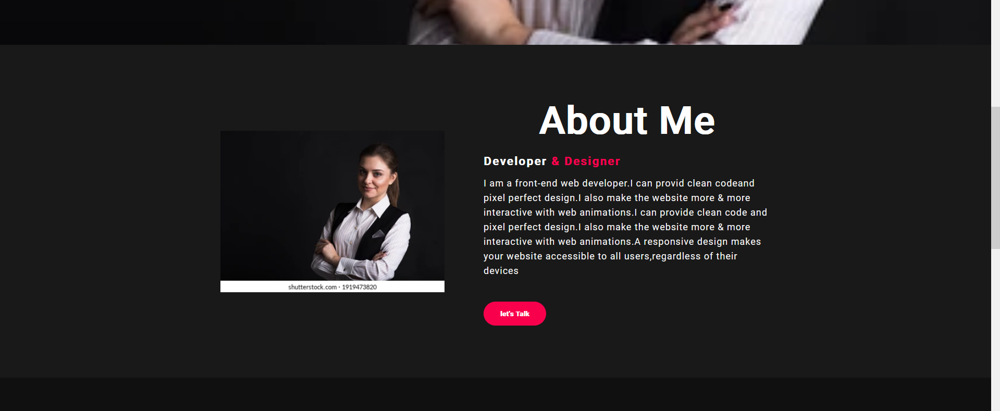
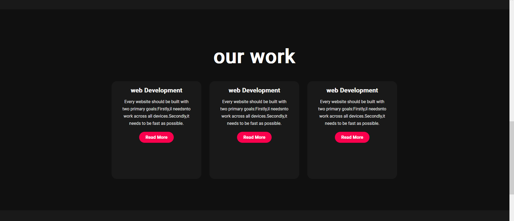
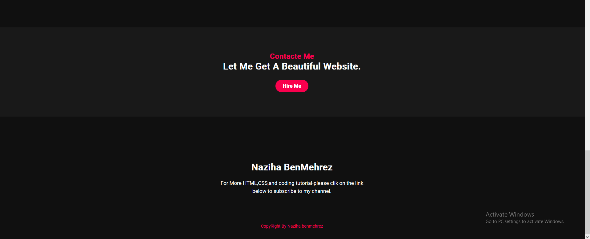

# Checkpoint-chap4
## Enoncé
1. Create a file `styles.css`.
2. Link it to our HTML project.
3. Change the display of the navbar to make it inline.
4. Change the font to roboto.
5. Add classes attributes to HTML / HTML documents .

Be creative !

## Les imprimes-écran
### Nav bar

### Section about

### Section work

### Section contact & footer
